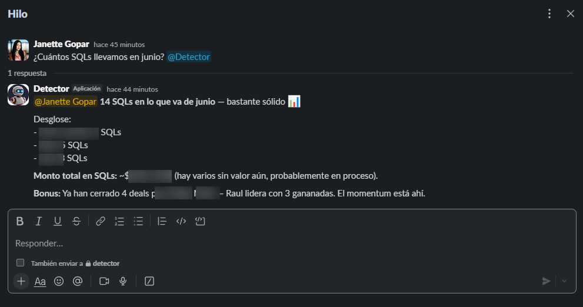

# Bot asistente de Growth

Bot de Slack con IA para equipos comerciales: responde preguntas en lenguaje natural usando datos en tiempo real del CRM, una base de conocimientos interna y búsqueda web.

## Cómo funciona

```
Usuario (Slack: DM o @mención en canal)
     │
     ▼
Slack Bot (Bolt + Socket Mode)
     │
     ▼
Claude (Anthropic, con tool use)
     │
     ├─► CRM API          ──► SQLs y deals ganados, actividades del equipo, status de un deal
     ├─► Web Search        ──► noticias, precios de mercado, regulaciones actualizadas
     └─► Base de conocimientos (/knowledge) ──► ICP, playbook, metodologías de ventas
     │
     ▼
Respuesta en Slack (hilo o DM)
```

El bot decide automáticamente cuándo consultar el CRM, buscar en internet o usar la base de conocimientos según la pregunta del usuario.

## Features

- *CRM en tiempo real:* SQLs y deals ganados por periodo, actividades del equipo (productividad), status de un deal por título
- *Base de conocimientos propia:* ICP, playbook y metodologías de venta desde archivos `.txt`, `.md` y `.pdf`
- *Búsqueda web automática:* noticias, precios de mercado y regulaciones, citando la fuente
- *Contexto por usuario:* mantiene historial de conversación en DMs y menciones de canal
- *Health check y estadísticas* vía HTTP

## Capturas

**Consulta al CRM:**



## Setup

```bash
npm install
cp .env.example .env   # completa tus credenciales
npm start
```

## Variables de entorno

| Variable | Descripción |
|---|---|
| `ANTHROPIC_API_KEY` | API key de Anthropic |
| `SLACK_BOT_TOKEN` / `SLACK_SIGNING_SECRET` / `SLACK_APP_TOKEN` | Credenciales de la Slack App (Socket Mode) |
| `PORT` | Puerto HTTP (default: `3000`) |
| `PIPEDRIVE_API_TOKEN` / `PIPEDRIVE_PIPELINE_ID` / `PIPEDRIVE_FIELD_CALIFICACION_SQL` | Credenciales del CRM (opcional) |

## Tech stack

- **Anthropic Claude (Haiku 4.5)** — modelo conversacional con tool use
- **Slack Bolt + Socket Mode** — integración con Slack
- **CRM API (Pipedrive)** — datos comerciales en tiempo real
- **Anthropic Web Search** — búsqueda web nativa con citas
- **Node.js / Express** — backend y health checks
- **Railway** — deploy
